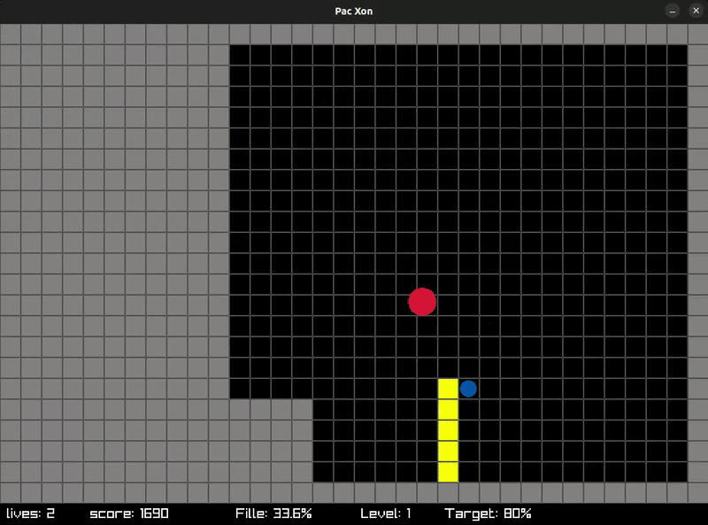

# Pac-Xon 

> A recreation of the classic arcade game **Pac-Xon**, built with **C** and **Raylib**. 




## Installation

### Linux:
Make sure the following are installed:
- raylib
- A C compiler (like gcc) 

then run:

```sh
bash build.bash
```

Or download the pre-built version from itch.io [here](https://shahd-moh-abdel.itch.io/pac-xon).

### Windows:
install
- raylib 
- A C compiler 
then compile using your preferred method.

## Tech stack
- Raylib
- C

## How to Play
- use the arrow keys to move the player
- fill empty space by drawing trails between the borders
- avoid the moving balls 
- fill enough of the board to complete the level

## Contributing

Fork it, create your feature branch, commit your changes, push to the branch, create a new pull request. 

[](https://award.athena.hackclub.com?utm_source=readme)
